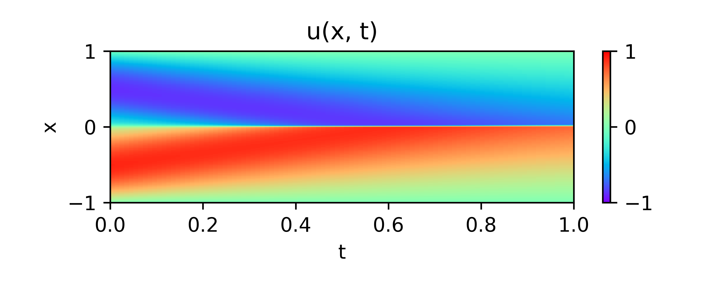
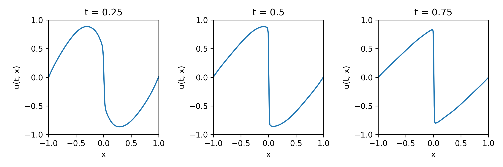

# Paper summary

**[Physics Informed Deep Learning (Part I): Data-driven Solutions of Nonlinear Partial Differential Equations](https://arxiv.org/abs/1711.10561)**

### Introduction
To utilize artificial neural networks for solving physical problems, one cannot rely only on the typical squeared error- or absolute error-based loss functions. After training (regardless of the fact that the loss function could not be minimized well) the model predicts an output that in most of cases is not consistent with governing equations of the system. In other words, the results does not satisfy the partial differential equation (PDE) describing the system. To overcome this problem, a new set of loss functions called **"Physics-Informed Loss Function (PILF)"** is defined based on the governing equations.

### Methodology
#### Parameters
|Parameter|Description|
|-|-|
|$\hat{u}(t, x)$| Exact solution for the studied PDE|
|$u(t, x)$| A neural-solution for the studied PDE|
|$N_d$| Number of data points|
|$N_c$|Number of collocation points|
|$N_{HL}$|Number of hidden layers|
|$N_{neuron}$|Number of neurons in each hidden layers|
#### Loss functions
|Name||Description|
|-|-|-|
|***MSE***|$\lambda_1$|$\frac{1}{N_d}\sum_{i=1}^{N_d}{(\hat{u}(t_i, x_i)-u(t_i, x_i))^2}$|
|***PILF***|$\lambda_2$|$\frac{1}{N_c}\sum_{i=1}^{N_c}{(\frac{\partial{u(t_i,x_i)}}{\partial{t}}-{x_i}\frac{\partial{u(t_i,x_i)}}{\partial{x}}-(\frac{0.01}{\pi})\frac{\partial^2{u(t_i,x_i)}}{\partial{x^2}})^2}$|
The partial differentiation operators in the PILF are implemented by `tf.GradientTape().gradient()` method. This means on a `@tf.function` instance, the gradients will be computated by automatic differentiation (AD). It should be noted that the most important part of the PILFs is AD-based gradients.
#### Optimizier
L-BFGS algorithm is used in the reference. Although, SGD and modern variants could be used too. (`tf.keras.optimizers.Adam()`in my implementation)
#### Network Architecture
Different network architectures were used in the reference work. The most convinient one is as follows:
|Layer|Shape|Activation Func.|Description|
|-|-|-|-|
|***Input layer*** |(2,)|Linear|$t$ and $x$|
|***Hidden Layer***|($N_{HL}=9$, $N_{neuron}=20$)|$tanh(x)$|-|
|***Output Layer***|(1,)|Linear|$u$|
#### Flowchart
The following flowchart shows the procedure of this work. The loop could be either an epoch-based `for` loop or a loss value-based `while` loop. Hence, the loop criteria indicates a general term for both.
```flow
start=>start: Start
end=>end
data_gen=>operation: generate data
cond1=>condition: Loop Criteria
comp_out=>operation: compute outputs
mse_loss=>subroutine: MSE 
                Compute L1
                on the data points
pi_loss=>subroutine: PILF
                Compute L2
                collocation points
grad_and_up=>operation: ∇(L1+L2) 
                w.r.t model parameters
                and update parameters
io1=>inputoutput: Results
start->data_gen->comp_out(left)->mse_loss->pi_loss(right)->grad_and_up->cond1(yes)->io1->end
cond1(no)->data_gen
```
#### Training data
Training data in this project could be devided into 2 groups:
**1. Data points:** Randomly sampled points in boundaries and initial state. The **MSE** loss function is applied on these points.
**2. Collocation points:** Randomly sampled points in the domain of the solution ($0\leq{t}\leq{1}$ , $-1\leq{x}\leq{+1}$). The **Physics-Informed Loss Function** is applied on this set of points.

### Results
#### 1. $u(t, x)$ profile:

#### 2. $u(t_j, x)$ plots for $t_j \in \{0.25, 0.50, 0.75\}$:
